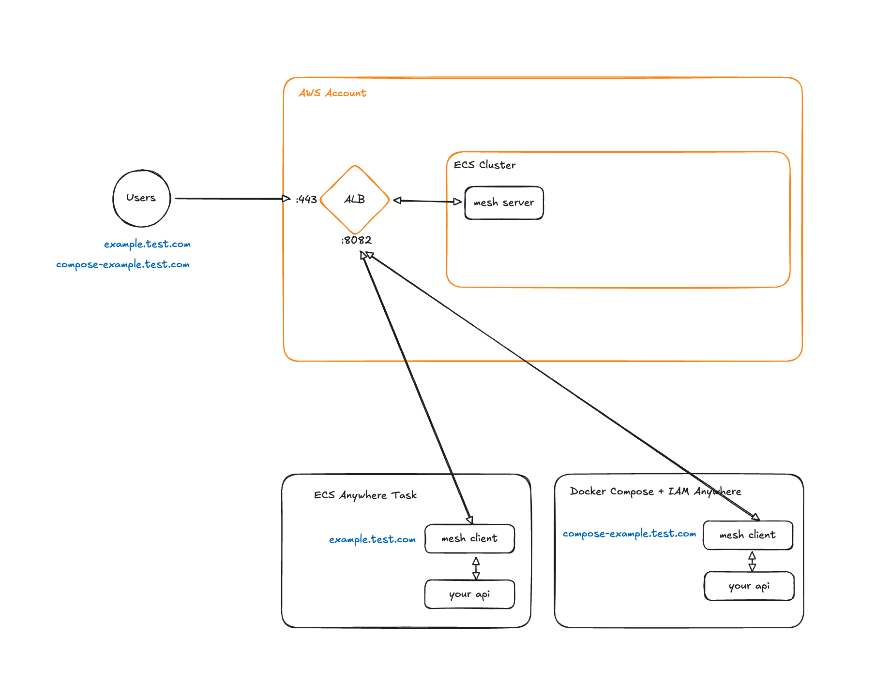
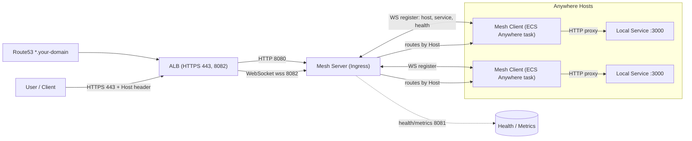

# Anywhere Mesh

Anywhere Mesh is a Rust-based ingress and client pair that lets ECS Anywhere tasks register themselves over WebSockets and receive HTTP traffic tunneled from an AWS Application Load Balancer (ALB). The repository also ships sample services, k6 scenarios, and infrastructure automation used to validate the mesh.

## The Problem This Solves

ECS Anywhere is a great way to run containers, but once you start to client requests from the cloud to your infra that isn't in AWS, there's no native AWS way to do this. Anywhere Mesh allows you to route requests to your own containers anywhere in the world so that you can use the best of AWS for reliability and security, and the best of your own infra for performance and cost.

## TL;DR;

- Sub out `infra/params.json` with your own values.
- Run `task deploy-e2e-infra` to deploy the infrastructure.
- Change `test-app/docker-compose.yml` to use your domain.

From here, you can test your local container against the mesh with curl. For example:

```bash
curl http://test-app.{your domain}/api/health
```

## Overview



- `mesh` provides a single CLI (`mesh`) with `server` and `client` subcommands.
- The ingress server terminates ALB HTTP traffic on port 8080, exposes WebSocket registration on 8082, serves health/metrics on 8081, and routes requests to healthy registered clients using host-based matching.
- Mesh clients watch a local service, perform optional IAM/ECS validation, maintain a WebSocket connection to the ingress, and proxy incoming requests back to the local HTTP endpoint.
- `test-app/` is an Axum sample that models the expected service interface and offers multiple diagnostic endpoints.
- `infra/` contains an AWS CDK stack that deploys an end-to-end environment (ALB, ECS Fargate tasks, Route53 records, and supporting IAM/logging).
- `load-test/` holds k6 smoke and WebSocket scenarios for regression coverage.

## Architecture at a glance



High level flow: clients register over WebSockets with the ingress and advertise a host name. Incoming HTTPS traffic from the ALB is routed by Host header to the matching registered client, which proxies the request to its local service (e.g., `http://127.0.0.1:3000`).

## Repository Layout

- `mesh/` – Rust workspace member for the `ecs` CLI (server, client, shared modules).
- `test-app/` – Axum demo service and docker-compose setup used during local and e2e tests.
- `infra/` – AWS CDK application (`bin/infra.ts`, `lib/stack.ts`) for provisioning the ingress, test workloads, and networking.
- `load-test/` – k6 scripts (`http-*.js`, `ws-connect.js`) and `env.example` to exercise the mesh.
- `config/` – YAML templates for client configuration; copy before editing to avoid committing secrets.
- `docs/` – Additional notes on integrations and security posture.
- `Taskfile.yml` – Taskfile targets for Docker builds, publishing, and e2e automation.
- `Dockerfile` – Multi-stage build used to package the CLI for ARM64/AMD64.

## Prerequisites

- Rust 1.70+ (Edition 2021) with the default toolchain; add the `aarch64-unknown-linux-gnu` target when building for ARM.
- Docker with Buildx for container images (optional but required for `task build`/`task push`).
- Node.js 18+ and npm for CDK synthesis and tests under `infra/`.
- AWS CLI with credentials configured for deploying or validating ECS resources.
- k6 (optional) for running load tests.
- `task` (https://taskfile.dev) if you prefer the Taskfile workflows.

## Build the CLI

```bash
# From the repository root
cargo build --release --bin mesh
./target/release/mesh --help
```

During development you can also run the binary through cargo:

```bash
cargo run --bin mesh -- server --help
cargo run --bin mesh -- client --help
```

## Local End-to-End Loop

1. Start the sample service (listens on `http://127.0.0.1:3000`):

   ```bash
   cd test-app
   cargo run --release
   ```

2. In another terminal, launch the ingress server from the repo root:

   ```bash
   cargo run --bin mesh -- server \
     --alb-port 8080 \
     --websocket-port 8082 \
     --request-timeout 30
   ```

3. Start a client that represents an ECS Anywhere task:

   ```bash
   cargo run --bin mesh -- client \
     --ingress-endpoint ws://127.0.0.1:8082 \
     --local-endpoint http://127.0.0.1:3000 \
     --host demo.local \
     --service-name test-app \
     --cluster-name dev-cluster \
     --health-check-path /api/health \
     --skip-iam-validation
   ```

4. Exercise routing through the ingress (the Host header controls the lookup):

   ```bash
   curl -H "Host: demo.local" http://127.0.0.1:8080/api/health
   ```

The client prints warnings if IAM validation is skipped; remove `--skip-iam-validation`.

## Docker & Taskfile Workflows

- `task build` – Build the container image for the current architecture.
- `task push` – Build and push a multi-arch image to the public ECR registry (requires `aws` login).
- `task load-test` – Bring up the docker-compose demo in `test-app/` and execute the k6 smoke + WebSocket tests.
- `task e2e` – Deploy the CDK stack and run the combined load test suite (see the `Taskfile.yml` for details).

The Dockerfile builds the Rust binary in a builder stage and outputs a minimal runtime layer targeting ARM64 by default.

## Load Testing

k6 scripts live under `load-test/` and can target either local or remote environments.

```bash
# Install dependencies
brew install k6 # or see k6.io for other platforms

# Quick smoke test against a local stack
TARGET_HOST=demo.local BASE_URL=http://127.0.0.1:8080 k6 run load-test/http-smoke.js

# WebSocket connectivity check (defaults to wss://HOST)
TARGET_HOST=demo.local WS_URL=ws://127.0.0.1:8082 k6 run load-test/ws-connect.js
```

Copy `load-test/env.example` to `.env` when working with multiple scenarios and shared settings.

## Infrastructure (CDK)

See `infra/README.md` for setup, parameters, and deployment steps.

For the canned e2e workflow use `task deploy-e2e-infra` and `task e2e-down` from the repository root.

## Debugging & Observability

```bash
# Enable verbose logging for the server
./target/release/mesh server --verbose --log-level debug

# Inspect registered services via the debug endpoint
curl -H "Host: your-service.com" http://localhost:8080/debug/services
```

Tracing is built with `tracing`/`tracing-subscriber`; set `RUST_LOG=debug` for granular output. The server also exposes health information on `http://localhost:8081/health`.

## Development Workflow

- `task lint` – Lint the code.
- `task test` – Run unit tests for the CLI.
- Prefer `anyhow::Context` when adding new errors and reuse existing `tracing` spans.

Run these commands prior to opening a pull request, and document any validation in commit/PR descriptions.

## Troubleshooting

- **Connection refused** – Check that the client is connected to the ingress (port 8082) and that the server is listening on the expected ports.
- **Host not routed** – Confirm the client registered the same host string used in your `Host` header.
- **IAM failures** – Ensure the local environment has permissions to call `ecs:DescribeCluster` and related APIs, or use `--skip-iam-validation` only in development.
- **Timeouts** – Increase `--request-timeout` on the server if requests take longer than 30 seconds.

## Contributing

1. Fork the repository and create a feature branch.
2. Make focused changes with accompanying tests.
3. Validate with `task lint`, `task test`, and relevant Taskfile targets.
4. Open a pull request describing the change, validation steps, and any infra diffs.

## License

MIT License (declared in the crate metadata).
